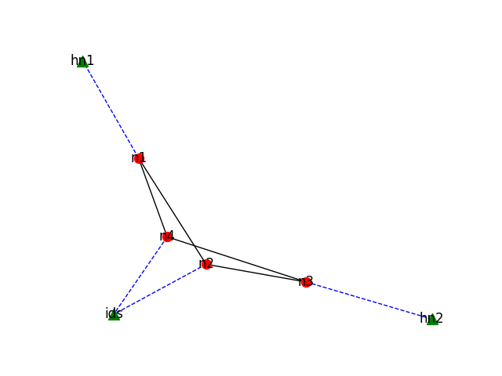

# Testbed

## Prerequisite

* Mininet, see [https://github.com/mininet/mininet](https://github.com/mininet/mininet)
* PyYAML
* networkx (cfggen.py)
* matplotlib (cfggen.py)


## Usage

```
usage: topogen.py [-h] [--controller CONTROLLER] config

Mininet topology generator

positional arguments:
  config                Topology configuration file

optional arguments:
  -h, --help            show this help message and exit
  --controller CONTROLLER
                        Remote controller, default 127.0.0.1:6653

```

## Configuration file format

```yaml
switches: [n1, n2, n3, n4]
hosts:
  hn1: {ip: 10.0.0.1, type: default} //ip  : ipv4 address
  hn2: {ip: 10.0.0.2, type: default} //type: optional, default or local, make sure just only one local node
  ids: {ip: null, type: local}       //local type host is in the root Linux network namespace
links:
- bw: 1000                       //bw  : optional, bandwidth, unit Mbps, default: unlimited
  endpoint1: {node: n1, port: 1} //node: mandatory, one item of switches
  endpoint2: {node: n2, port: 2} //port: optional, port number, also OpenFlow id, default: incremental, the name of the port "%s-eth%d"%(node,port)
```

## Example

```
python topogen.py config/topo.yaml
```





some tests

```
sh ovs-ofctl add-flow n2 -O OpenFlow13 in_port=1,action=output:2,3
sh ovs-ofctl add-flow n2 -O OpenFlow13 in_port=2,action=output:1,3
sh ovs-ofctl add-flow n1 -O OpenFlow13 ip,ip_dst=10.0.0.2,action=output:1
sh ovs-ofctl add-flow n1 -O OpenFlow13 ip,ip_dst=10.0.0.1,action=output:3
sh ovs-ofctl add-flow n3 -O OpenFlow13 ip,ip_dst=10.0.0.2,action=output:3
sh ovs-ofctl add-flow n3 -O OpenFlow13 ip,ip_dst=10.0.0.1,action=output:1

hn2 python -m SimpleHTTPServer 80 &
ids cd /home/yutao/Desktop/trident-demo/testbed/bro
ids bro -C -i ids-eth0 http.bro > output0.log &

hn1 curl http://10.0.0.2
```