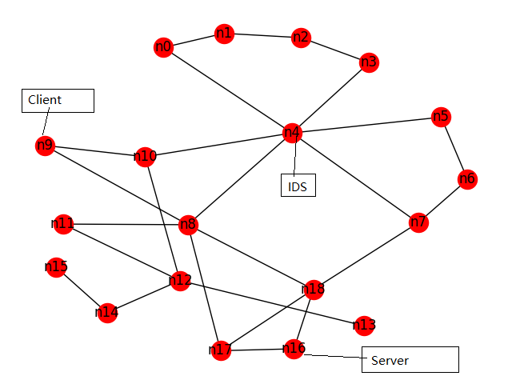
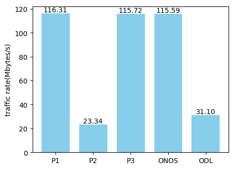

# test3

### 测试环境:

* Intel(R) Core(TM) i7-6700 CPU @ 3.40GHz
* 8G DDR4 memory + 4G swap
* Ubuntu 16.04
* OpenDaylight Carbon
* ONOS 1.12.0
* Mininet 2.3.0d1

### 测试拓扑: Noel

与n4连接的链路bandwidth为200M, 其余都是1000M

### 测试方法:

Server节点运行nginx 1.10.3

Client节点使用apache benchmark (2.3)测试传输速率

测试命令:`ab -c 10 -n 100 http://10.0.0.7/50M.dat`, 并发量为10，nginx不会成为bottleneck

### 结果:

* P1 是最短路径策略
* P2 是必须经过n4并且转发到IDS
* P3 是在flow属性未知时必须经过n4,转发到IDS，确定flow属性安全后按最短路径转发(测试时是httpurl.contains('.dat')即所有测试流都是安全的)
* ONOS 是使用ONOS的fwd应用，其内部使用了Intent
* ODL 是使用ODL的l2switch，因为其采用广播策略，虽然不会经过n4，但效率低

这里可以得到两个结果，一是系统效率不比ONOS低，二是在测试情形之下，上层应用使用了Network Function 提供的属性所导致的性能损失很低，相比P2可以很大程度上提高效率

TODO: 50M的数据量有些大了，5M的话可能P3应该会低一些，但是apache benchmark结果不稳定，在找更合理的测试方案