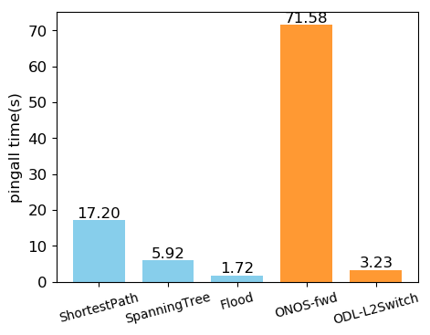
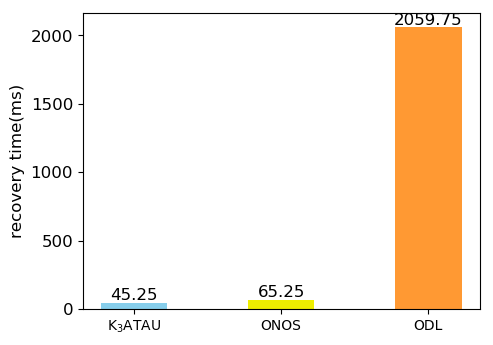
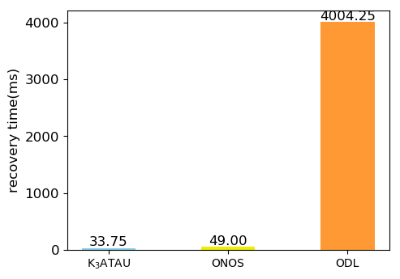

# 测试环境:

* Intel(R) Core(TM) i7-6700 CPU @ 3.40GHz
* 8G DDR4 memory + 4G swap
* Ubuntu 16.04
* OpenDaylight Carbon
* ONOS 1.12.0
* Mininet 2.3.0d1

# test1

获取Mininet启动之后第一次执行pingall命令的消耗时间，衡量控制器的响应速度

### 结果:

其中

* SP : 使用最短路径的应用,生成的流表会匹配端口，源和目的地址
* ST : 以目的端口为根节点，计算最小生成树，生成的流表匹配端口和目的地址
* Flood : 以一个固定端口为根，且计算过程中保持一定的顺序，对整个拓扑计算一个固定的最小生成树，生成的流表只匹配端口
* ONOS : ONOS-fwd应用
* ODL : ODL l2switch应用

可以得到的结论有，

* 可以用不同的算法实现L2Switch的应用, 效率上也不相同
* 和ONOS相比，响应速度都快于ONOS
* 和ODL相比，因为ODL-l2switch网络内部链路使用广播方式，和Flood应用相比，Flood应用的响应速度也更快

# test2

使用一个周期的udp数据流测量网络的恢复时间

### 结果:

switch down:

link down:

测试时，在link down的情况下ONOS无法恢复

可以得到的结论有，

* 系统可以快速恢复

# test3

### 测试拓扑: Noel

与n4连接的链路bandwidth为200M, 其余都是1000M

### 测试方法:

Server节点运行nginx 1.10.3

Client节点使用apache benchmark (2.3)测试传输速率

测试命令类似`ab -c 10 -n 100 http://10.0.0.7/50M.dat`, `-c 10` 表示并发量为10，nginx不会成为bottleneck，测试P3分别使用了1M,10M,50M的数据量，其他测试结果为50M的数据量，因为其他测试结果不会受到数据量影响，测试结果数值接近

### 结果:

* P1 是最短路径策略
* P2 是必须经过n4并且转发到IDS
* P3 是在flow属性未知时必须经过n4,转发到IDS，确定flow属性安全后按最短路径转发(测试时是httpurl.contains('.dat')即所有测试流都是安全的),P3-1是数据量为1M的测试结果，P3-2是数据量为10M的测试结果，P3-3是数据量为50M的测试结果，三者的不同是因为经过IDS和在高速路径上转发的数据包比例不同
* ONOS 是使用ONOS的fwd应用，其内部使用了Intent
* ODL 是使用ODL的l2switch，因为其采用广播策略，虽然不会经过n4，但效率低

~~这里可以得到两个结果，一是系统效率不比ONOS低，二是在测试情形之下，上层应用使用了Network Function 提供的属性所导致的性能损失很低，相比P2可以很大程度上提高传输的效率~~

可以得到结果，在测试情形之下，上层应用使用了Network Function 提供的属性所导致的性能损失很低，相比P2可以很大程度上提高传输的效率
